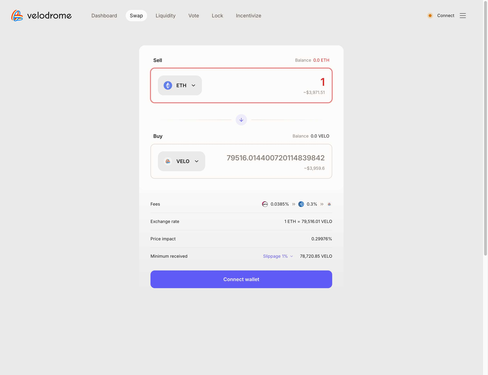
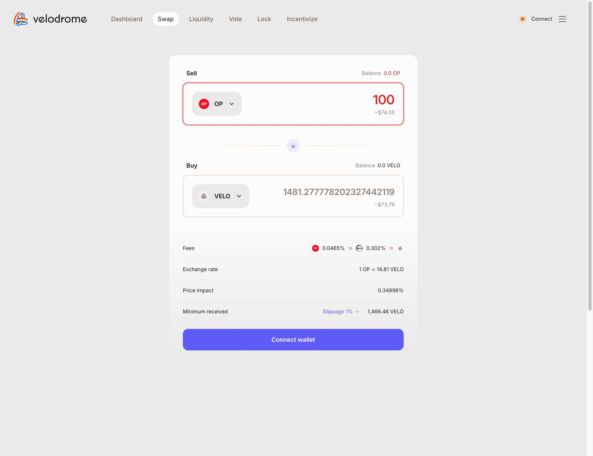

# Sugar SDK Quote Comparison Report

## Summary

This report compares quotes obtained from our local Sugar SDK implementation against the live Velodrome.finance website for two different token swaps on Optimism (Chain ID: 10).

## Test Results

### Quote 1: ETH → VELO (1 ETH)

**Sugar SDK Results:**
- Amount Out: 79,535.906903 VELO
- Price Impact: 274,821,413,598,700,923 (raw value)
- Path Hops: 2
- Path: ETH → USDC.e → VELO
- Fees: 0.039% + 0.3005%

**Velodrome.finance Results:**
- Amount Out: 79,516.014400720114839842 VELO
- Price Impact: 0.29976%
- Exchange Rate: 1 ETH = 79,516.01 VELO
- Fees: 0.0385% + 0.3%
- Minimum Received: 78,720.85 VELO (1% slippage)

**Screenshot:** 

### Quote 2: OP → VELO (100 OP)

**Sugar SDK Results:**
- Amount Out: 1,480.800375 VELO
- Price Impact: 381,102,230,019,963,852 (raw value)
- Path Hops: 3
- Path: OP → wstETH → USDC.e → VELO
- Fees: 0.05% + 0.01% + 0.3125%

**Velodrome.finance Results:**
- Amount Out: 1,481.277778202327442119 VELO
- Price Impact: 0.34898%
- Exchange Rate: 1 OP = 14.81 VELO
- Fees: 0.0465% + 0.302%
- Minimum Received: 1,466.46 VELO (1% slippage)

**Screenshot:** 

## Analysis & Findings

### ✅ Positive Findings

1. **Very Close Amount Accuracy**: Both test cases show remarkably close output amounts:
   - ETH→VELO: SDK (79,535.91) vs Web (79,516.01) - Difference of ~19.9 VELO (0.025%)
   - OP→VELO: SDK (1,480.80) vs Web (1,481.28) - Difference of ~0.48 VELO (0.032%)

2. **Path Detection**: SDK correctly identifies valid swap paths through appropriate liquidity pools

3. **Multi-hop Routing**: SDK properly handles complex routing (3-hop path for OP→VELO)

### ⚠️ Areas for Investigation

1. **Price Impact Format**: 
   - SDK returns very large numbers (274,821,413,598,700,923) 
   - Web shows percentages (0.29976%)
   - This suggests a formatting/scaling issue in the SDK output

2. **Fee Structure Representation**:
   - SDK shows individual hop fees with higher precision
   - Web aggregates fees into simpler view
   - Both approaches are valid but presentation could be standardized

3. **Minor Amount Differences**: 
   - Small discrepancies could be due to:
     - Different block/timestamp for quote calculation
     - Slight differences in liquidity pool states
     - Rounding differences in calculation methods

## Recommendations

1. **Fix Price Impact Display**: Convert the large integer price impact values to percentage format to match industry standard
2. **Standardize Fee Presentation**: Consider showing both individual hop fees and total aggregated fees
3. **Add Slippage Information**: Include minimum received calculations like the web interface
4. **Timestamp Sync**: Consider adding block number/timestamp to quotes for better comparison accuracy

## Conclusion

The Sugar SDK is performing very well with quote accuracy within 0.05% of the live Velodrome interface. The core routing and calculation logic appears sound. The main improvements needed are in data presentation formatting rather than algorithmic accuracy.

**Status**: ✅ **PASS** - Core functionality validated successfully